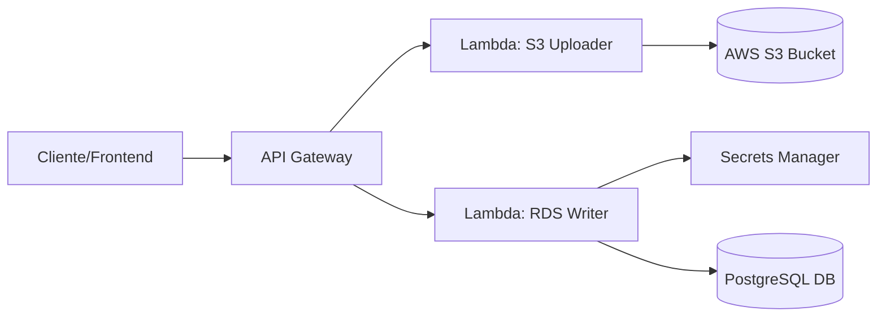

# Aproil Backend - AWS Serverless Infrastructure

Este repositorio contiene la lógica de backend para el proyecto **Aproil**. Está construido sobre una arquitectura **Serverless** utilizando AWS Lambdas (Python), gestionando almacenamiento en **S3** y persistencia de datos relacionales en **Amazon RDS (PostgreSQL)**.

## Tabla de Contenidos
- [Arquitectura](#arquitectura)
- [Pre-requisitos](#pre-requisitos)
- [Estructura del Proyecto](#estructura-del-proyecto)
- [Instalación y Configuración](#instalación-y-configuración)
- [Variables de Entorno](#variables-de-entorno)
- [Despliegue (Deployment)](#despliegue)
- [Pruebas](#pruebas)

---

## Arquitectura

El backend expone funciones computacionales bajo demanda que interactúan con servicios gestionados de AWS:

1.  **S3 Lambda Handler:** Genera reportes de texto con timestamp y los almacena en un Bucket S3 privado.
2.  **RDS Lambda Handler:** Recibe solicitudes de escritura, recupera credenciales seguras desde AWS Secrets Manager y registra logs de auditoría en una base de datos PostgreSQL.



---

## Pre-requisitos

Para ejecutar y desplegar este proyecto en tu propio entorno AWS, necesitas tener instalado:

* **Python 3.9+**
* **Git**
* **AWS CLI** (Configurado con `aws configure`)
* **Terraform** (Opcional, si usas IaC para desplegar)
* **Docker** (Opcional, para empaquetar dependencias de Python como `pg8000`)

---

## Estructura del Proyecto

```text
aproil-backend/
├── lambdas/
│   ├── s3_handler/
│   │   ├── lambda_function.py   # Lógica para subir archivos a S3
│   │   └── requirements.txt     # Dependencias (boto3)
│   └── rds_handler/
│       ├── lambda_function.py   # Lógica para escribir en RDS
│       └── requirements.txt     # Dependencias (pg8000, boto3)
├── terraform/                   # Scripts de infraestructura (IaC)
├── jenkins/                     # Pipelines y scripts de CI/CD
│   └── Jenkinsfile              # Definición del pipeline de despliegue
└── README.md
```

---

## Instalación y Configuración

Sigue estos pasos para preparar el entorno de desarrollo local:

1.  **Clonar el repositorio:**
    ```bash
    git clone [https://github.com/RAgredaIpar/aproil-backend.git](https://github.com/RAgredaIpar/aproil-backend.git)
    cd aproil-backend
    ```

2.  **Crear un entorno virtual (Recomendado):**
    ```bash
    python -m venv venv
    # En Windows:
    venv\Scripts\activate
    # En Mac/Linux:
    source venv/bin/activate
    ```

3.  **Instalar dependencias:**
    Cada función lambda tiene sus propios requisitos.
    ```bash
    pip install -r lambdas/rds_handler/requirements.txt
    ```

---

## Variables de Entorno

Para que las Lambdas funcionen correctamente en AWS, deben configurarse las siguientes variables de entorno en la consola de AWS Lambda o en tu script de Terraform:

### Para `s3_handler`:
| Variable | Descripción | Ejemplo |
| :--- | :--- | :--- |
| `BUCKET_NAME` | El nombre único del bucket S3 destino | `aproil-landing-data-prod` |

### Para `rds_handler`:
| Variable | Descripción | Ejemplo |
| :--- | :--- | :--- |
| `SECRET_ARN` | ARN del secreto en AWS Secrets Manager con las credenciales DB | `arn:aws:secretsmanager:us-east-1:xxx:secret:xxx` |
| `DB_HOST` | Endpoint de la instancia RDS | `aproil-db.xxxx.us-east-1.rds.amazonaws.com` |
| `DB_NAME` | Nombre de la base de datos | `aproil_db` |

> **Nota:** La Lambda RDS espera que el secreto en Secrets Manager sea un JSON con las claves: `spring.datasource.username` y `spring.datasource.password`.

---

## Despliegue

### Opción A: Despliegue Manual (Zip)

1.  Ve a la carpeta de la lambda (ej. `lambdas/rds_handler`).
2.  Instala las dependencias en la misma carpeta:
    ```bash
    pip install -r requirements.txt -t .
    ```
3.  Comprime todo el contenido de la carpeta en un archivo `.zip`.
4.  Sube el `.zip` a la consola de AWS Lambda.

### Opción B: Despliegue con Terraform

Si el repositorio incluye carpeta de infraestructura:

```bash
cd terraform
terraform init
terraform plan
terraform apply
```

Esto creará automáticamente los recursos (S3, RDS, Lambdas, Roles IAM) y devolverá las URLs del API Gateway.

### Opción C: CI/CD Automático (Jenkins)

El proyecto incluye una configuración de Pipeline declarativo en `jenkins/Jenkinsfile`. Este flujo automatiza el despliegue de infraestructura y código cada vez que se detectan cambios en el repositorio.

**Flujo del Pipeline:**
1.  **Checkout:** Descarga el código fuente.
2.  **Build/Package:** Prepara los archivos `.zip` de las Lambdas.
3.  **Terraform Plan:** Muestra los cambios de infraestructura propuestos.
4.  **Terraform Apply:** Aplica los cambios en AWS (solo en rama `main` o aprobación manual).

**Requisitos en Jenkins:**
Para que el pipeline funcione, el servidor Jenkins debe tener configuradas las credenciales de AWS (Access Key y Secret Key) como secretos globales o credenciales del sistema.

---

## Pruebas

### Probar Lambda RDS (Localmente con script de prueba)
Puedes simular la ejecución creando un archivo `test_local.py`:

```python
# test_local.py
from lambdas.s3_handler.lambda_function import lambda_handler

event = {} # Mock del evento
context = None
response = lambda_handler(event, context)
print(response)
```

### Probar Endpoints (Una vez desplegado)
Usa `curl` o Postman con la URL que te provea API Gateway:

```bash
# Prueba S3
curl -X POST [https://tu-api-gateway.amazonaws.com/prod/upload-s3](https://tu-api-gateway.amazonaws.com/prod/upload-s3)

# Prueba RDS
curl -X POST [https://tu-api-gateway.amazonaws.com/prod/write-log](https://tu-api-gateway.amazonaws.com/prod/write-log)
```

---

**Autores:** 
- [RAgredaIpar](https://github.com/RAgredaIpar)
- [SebastianG15](https://github.com/SebastianG15)